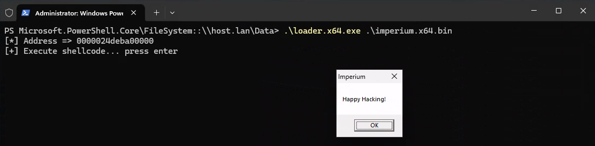

# Imperium



# Features
* Global instance stored in the PEB
* Native support for (in)direct syscall
* No IAT, can call any win32/nt API without worrying about resolving it
* Compile time hashing using consteval

# Template

```c++
/*!
 * @brief
 *  main function put your code here
 *
 * @param Param
 *  parameters
 */
FUNC VOID Main(
    IN PVOID Param
) {
    IMPERIUM_INSTANCE

    //
    // call LoadLibraryA to have the needed module is our peb
    // wont be able to resolve their functions otherwise
    //
    if ( ! Imperium::win32::call< fnLoadLibraryA >( H_FUNC( "kernel32!LoadLibraryA" ), "user32.dll" ) ) {
        return;
    }

    Imperium::win32::call< fnMessageBoxA >( H_FUNC( "user32!MessageBoxA" ), NULL, "Happy Hacking!", "Imperium", MB_OK );
}
```

# Credits

This project could not have been accomplished without the amazing work of [5pider](https://twitter.com/C5pider)
on those projects :
* [Stardust](https://github.com/Cracked5pider/Stardust) : I would have been able to make this template PIC otherwise
* Firebeam template : my template is highly inspired from it