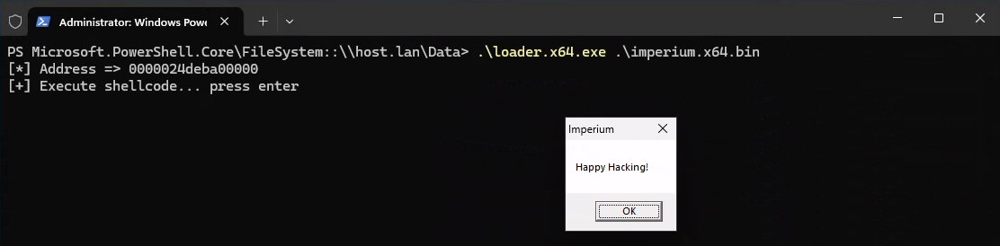

# Imperium



## Features

- Global instance stored in the `PEB`
- Native support for `(in)direct syscall`
- No `IAT`, can call any `win32` or `NT` API without having to worry about resolving it (through fancy syntax)
- Compile time hashing using `consteval`
- Output to `shellcode`, `dll`, `exe` 

## Template

```c++
/*!
 * @brief
 *  main function put your code here
 *
 * @param Param
 *  parameters
 */
FUNC VOID Main(
    IN PVOID Param
) {
    IMPERIUM_INSTANCE

    //
    // call LoadLibraryA to have the needed module is our peb
    // wont be able to resolve their functions otherwise
    //
    if ( ! Imperium::win32::call< fnLoadLibraryA >( H_FUNC( "kernel32!LoadLibraryA" ), "user32.dll" ) ) {
        return;
    }

    Imperium::win32::call< fnMessageBoxA >( H_FUNC( "user32!MessageBoxA" ), NULL, "Happy Hacking!", "Imperium", MB_OK );
}

```

## Compiling

The recommended compilations methods are through `nix` and `docker` (docker just wraps `nix`).

> [!TIP]
> You can probably compile the project from any type of operating system if you meet the dependencies. However, your package manager is probably gonna use the latest version of the `g++` compiler, and it is known that when upgrading things break.
>
> So if you want to be sure that nothing breaks, I recommended using `nix` which uses a fixed version of the compiler.

## Nix

Just type `nix develop` and you will have all dependencies :

```sh
$ nix develop
Imperium cross-compilation environment
======================================

Available commands:
  make pic     - Build x64 shellcode
  make dll     - Build x64 dll
  make exe     - Build x64 exe
  make loader  - Build x64 shellcode loader
  make clean   - Clean binaries

Environment ready!
$ make exe
-> compiling x64 exe
```

## Docker

You can build the image :

```sh
docker build -t imperium .
```


And the build the project :

```sh
docker run --rm -it -v .:/workspace imperium
Imperium cross-compilation environment
======================================

Available commands:
  make pic     - Build x64 shellcode
  make dll     - Build x64 dll
  make exe     - Build x64 exe
  make loader  - Build x64 shellcode loader
  make clean   - Clean binaries

Environment ready!
bash-5.2# make exe
-> compiling x64 exe
```

## Scripts

### Def

Takes an `url` as argument and returns the definition for the function ready to be copy and paste as a type :
```sh

./scripts/def.py
usage: ./scripts/def.py <url>
```

# Credits

This project could not have been accomplished without the amazing work of [5pider](https://twitter.com/C5pider) on those projects :

- [Stardust](https://github.com/Cracked5pider/Stardust) : I would have been able to make this template PIC otherwise
- Firebeam template : my template is highly inspired from it
